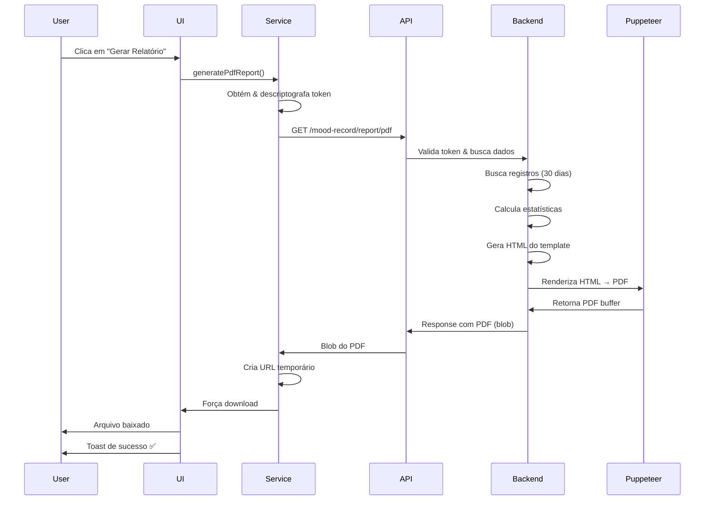

# 📄 Funcionalidade: Relatório PDF de Humor

## 🎯 Descrição

Permite aos usuários gerar e baixar um relatório completo em PDF com análise detalhada dos últimos 30 dias de registros de humor, incluindo estatísticas, tendências, insights da IA e visualizações.

---

## 🏗️ Arquitetura

### **Backend (NestJS)**

**Endpoint:**

```
GET /mood-record/report/pdf
```

**Headers:**

```
Authorization: Bearer <token>
```

**Response:**

- Content-Type: `application/pdf`
- Content-Disposition: `attachment; filename="relatorio-mentis-{nome}-{data}.pdf"`
- Body: Binary PDF data

**Tecnologias:**

- **Puppeteer**: Geração do PDF a partir de HTML
- **Prisma**: Busca de dados do banco
- **Template HTML**: HTML customizado com CSS inline

**Dados incluídos:**

- ✅ Informações do usuário (nome, email)
- ✅ Período do relatório (últimos 30 dias)
- ✅ Total de registros
- ✅ Sequência (streak) de dias consecutivos
- ✅ Estatísticas médias de todas as métricas
- ✅ Tendências (evolução primeiro → último registro)
- ✅ Score de bem-estar geral (calculado)
- ✅ Tabela com últimos 10 registros
- ✅ Insights da IA para cada registro

---

### **Frontend (React + TypeScript)**

#### **Service Layer**

**Arquivo:** `src/services/mood-stats.service.ts`

**Método:**

```typescript
async generatePdfReport(): Promise<void>
```

**Funcionamento:**

1. Obtém token criptografado do localStorage
2. Descriptografa o token usando `decrypt()`
3. Faz requisição fetch para o endpoint `/report/pdf`
4. Recebe o blob do PDF
5. Cria URL temporário com `window.URL.createObjectURL()`
6. Cria elemento `<a>` temporário
7. Força o download do arquivo
8. Limpa o URL temporário

**Benefícios da abordagem:**

- ✅ Download direto no navegador
- ✅ Nome de arquivo customizado
- ✅ Sem abrir nova aba
- ✅ Melhor UX para usuário

---

#### **UI Components**

**Arquivo:** `src/pages/MoodTracker/MoodStatsPage.tsx`

**Elementos visuais:**

**1. Botão no Header (compacto)**

- Localização: Ao lado do badge de registros
- Ícone: `FileText`
- Comportamento:
  - Desktop: "Gerar Relatório PDF"
  - Mobile: Apenas ícone
  - Loading: Spinner + "Gerando..."
  - Desabilitado: Quando sem registros

**2. Card de Destaque (chamativo)**

- Localização: Abaixo dos cards de estatísticas
- Design:
  - Background gradiente (blue → purple)
  - Ícone grande em card colorido
  - Título descritivo
  - Descrição explicativa
  - Botão de ação grande
- Visibilidade: Apenas quando `totalRecords > 0`

---

## 🎨 Design System

### **Cores**

```css
/* Background gradiente */
from-blue-50 to-purple-50 (light mode)
from-blue-950/20 to-purple-950/20 (dark mode)

/* Border */
border-blue-200 (light mode)
border-blue-800 (dark mode)

/* Botão principal */
from-blue-600 to-purple-600
hover: from-blue-700 to-purple-700

/* Ícone background */
from-blue-500 to-purple-600
```

### **Ícones**

- `FileText`: Relatório/documento
- `Download`: Ação de baixar
- `Loader2`: Loading/processando

### **Estados**

**Loading:**

- Botão desabilitado
- Spinner animado
- Texto "Gerando..." ou "Gerando PDF..."

**Success:**

- Toast com ícone ✅
- Mensagem: "📄 Relatório PDF baixado com sucesso!"
- Download automático do arquivo

**Error:**

- Toast com ícone ❌
- Mensagem: "❌ Erro ao gerar relatório. Tente novamente."
- Log no console

**Disabled:**

- Quando `totalRecords === 0`
- Quando `isPending === true`

---

## 🔄 Fluxo Completo



---

## 📋 Conteúdo do Relatório PDF

### **Seções:**

1. **Header**

   - Logo Mentis
   - Título: "Relatório de Bem-Estar Emocional"
   - Data de geração

2. **Informações do Usuário**

   - Nome
   - Email
   - Período analisado

3. **Resumo Executivo**

   - Total de registros
   - Sequência de dias (streak) 🔥
   - Score de bem-estar geral

4. **Estatísticas Médias** (Cards)

   - Humor Médio (😊)
   - Ansiedade Média (😰)
   - Energia Média (⚡)
   - Qualidade do Sono (💤)
   - Nível de Estresse (😓)
   - Bem-Estar Geral (🎯)

5. **Tendências Recentes**

   - Evolução do humor (↑ ↓ →)
   - Evolução da ansiedade
   - Evolução do estresse
   - Comparação primeiro vs último registro

6. **Histórico Detalhado** (Tabela)

   - Data de cada registro
   - Scores de todas as métricas
   - Insights da IA (quando disponível)
   - Últimos 10 registros

7. **Footer**
   - Rodapé com logo
   - Copyright
   - Mensagem de apoio

---

## 🎯 Features

### **Backend**

- ✅ Autenticação via JWT
- ✅ Busca otimizada (últimos 30 dias)
- ✅ Cálculo automático de estatísticas
- ✅ Template HTML responsivo
- ✅ Geração de PDF com Puppeteer
- ✅ Nome de arquivo customizado
- ✅ Headers corretos para download
- ✅ Error handling completo

### **Frontend**

- ✅ Botão no header (sempre visível)
- ✅ Card de destaque (CTAs fortes)
- ✅ Loading states (spinner + texto)
- ✅ Toast notifications (sucesso/erro)
- ✅ Download automático
- ✅ Desabilita quando sem dados
- ✅ Responsivo (mobile/desktop)
- ✅ React Query mutation
- ✅ Error handling

---

## 💡 Melhorias Futuras

### **Backend**

- [ ] Adicionar gráficos no PDF (recharts → imagem)
- [ ] Permitir escolher período customizado
- [ ] Cache de relatórios gerados recentemente
- [ ] Envio do PDF por email
- [ ] Relatório em outros formatos (Excel, CSV)

### **Frontend**

- [ ] Preview do relatório antes de baixar
- [ ] Opções de customização (período, métricas)
- [ ] Histórico de relatórios gerados
- [ ] Compartilhar relatório (link temporário)
- [ ] Progress bar durante geração
- [ ] Múltiplos formatos (PDF, Excel, etc)

---

## 🧪 Como Testar

### **1. Pré-requisitos**

- Usuário autenticado
- Pelo menos 1 registro de humor salvo

### **2. Teste Básico**

1. Navegue para `/mood-tracker` → aba "Estatísticas"
2. Verifique se os cards de estatísticas aparecem
3. Clique no botão "Gerar Relatório PDF" (header ou card)
4. Aguarde o loading
5. Verifique se o PDF foi baixado
6. Abra o PDF e valide o conteúdo

### **3. Testes de Edge Cases**

**Sem registros:**

- Botão deve estar desabilitado
- Card de destaque não deve aparecer

**Durante loading:**

- Botão deve mostrar spinner
- Texto deve mudar para "Gerando..."
- Botão deve estar desabilitado

**Erro de rede:**

- Toast de erro deve aparecer
- Console deve mostrar erro
- Botão deve voltar ao estado normal

**Token inválido/expirado:**

- Deve redirecionar para login
- Toast de erro deve aparecer

---

## 📊 Métricas de Sucesso

- **Taxa de geração**: % de usuários que geram relatório
- **Frequência**: Quantos relatórios por usuário/mês
- **Tempo médio**: Tempo de geração do PDF
- **Taxa de erro**: % de falhas na geração
- **Satisfação**: Feedback dos usuários

---

## 🔒 Segurança

**Backend:**

- ✅ Autenticação obrigatória (JWT)
- ✅ Validação de userId
- ✅ Dados filtrados por usuário
- ✅ Sem exposição de dados sensíveis
- ✅ Rate limiting (recomendado)

**Frontend:**

- ✅ Token criptografado no localStorage
- ✅ Descriptografia apenas no momento do uso
- ✅ Headers Authorization corretos
- ✅ Tratamento de erros 401/403
- ✅ Limpeza de URLs temporários

---

## 📦 Dependências

**Backend:**

- `puppeteer`: Geração de PDF
- `@nestjs/common`: Framework
- `@prisma/client`: ORM

**Frontend:**

- `@tanstack/react-query`: State management
- `react-hot-toast`: Notificações
- `lucide-react`: Ícones
- `crypto-js`: Criptografia de token

---

## 🚀 Deploy

**Backend:**

- Instalar Puppeteer no servidor
- Configurar variáveis de ambiente
- Puppeteer headless mode
- Args: `--no-sandbox`, `--disable-setuid-sandbox`

**Frontend:**

- Build normal com Vite
- Variáveis: `VITE_API_URL`, `VITE_CRYPT`

---

**Desenvolvido com 💜 para Mentis**
